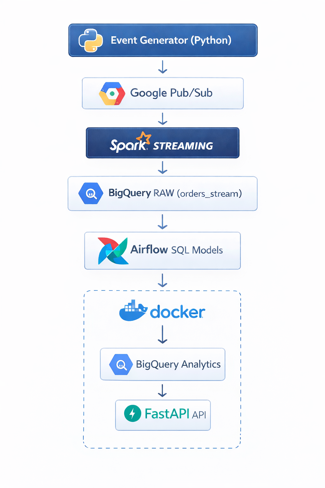

# MELI Data Platform (Streaming Analytics Pipeline)

Este proyecto implementa una plataforma de datos end-to-end que simula el flujo de datos de un marketplace de e-commerce.

El sistema genera eventos de órdenes en tiempo real, los procesa con Spark Streaming, los almacena en BigQuery,
ejecuta transformaciones analíticas con Airflow y expone métricas mediante una API con FastAPI.

## Arquitectura

  

## Tecnologías utilizadas

- Python
- Apache Spark
- Google Cloud Pub/Sub
- BigQuery
- Apache Airflow
- FastAPI
- Docker

## Flujo del pipeline

1. Generación de eventos sintéticos de órdenes.
2. Publicación de eventos en Pub/Sub.
3. Consumo y procesamiento con Spark Streaming (micro-batches).
4. Validación de calidad de datos.
5. Almacenamiento en BigQuery RAW.
6. Transformaciones analíticas orquestadas con Airflow.
7. Exposición de datos analíticos mediante FastAPI.

## Endpoints

### Health Check
GET /health

Respuesta:
{
  "status": "ok"
}

### Top Categories
GET /top-categories

Devuelve las categorías con mayor volumen de ventas.

## Capturas del proyecto

## Habilidades demostradas

- Streaming data pipelines
- Spark micro-batch processing
- Data quality validation
- BigQuery analytical modeling
- Workflow orchestration with Airflow
- Building analytics APIs with FastAPI
- Containerized data platform architecture
